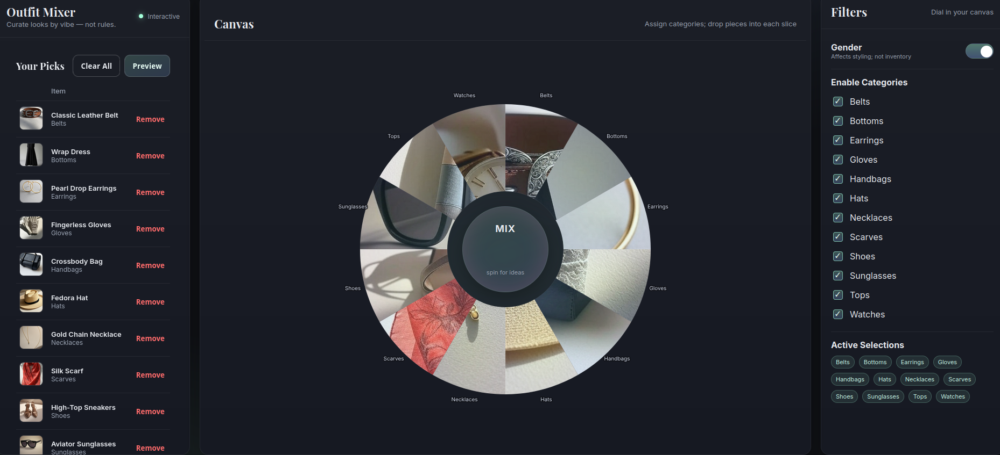
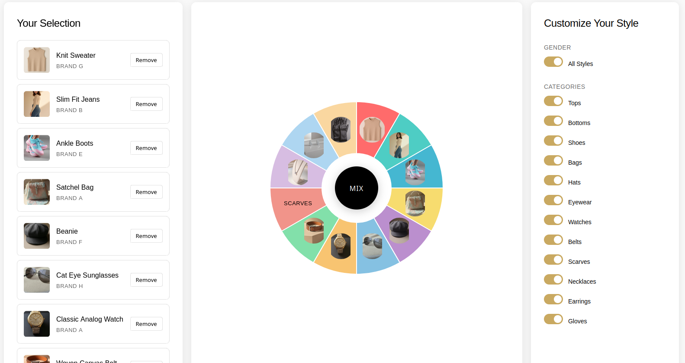

## A Simple Coding Agent Eval

This repository documents the outputs of various coding agent for evaluations. The goal is to build intuition about the capabilities and limitations of popular coding agents.

This benchmark represents my personal experiments with various AI coding assistants, not a rigorous scientific study or official evaluation. The scores and observations are entirely subjective, based on my own criteria and preferences for UI implementation. Additionally, LLMs are non-deterministic by nature — running the same prompt multiple times may produce different outcomes. Different users might reach completely different conclusions based on their priorities. Consider this a snapshot of one developer's experience rather than authoritative guidance on tool selection. 

## Methodology

The same [prompt](prompt.md) is used for all tests. For each run, we ask the coding agent to to one-shot the challenge. If that does not turn out well, we manually prompt the agent and try to fix obvious issues with a maximum of 10 attempts.

To isolate the context, we run each coding agent in an empty folder called "workspace". This way the artifacts from other models do not interfere with the current model.

There's a script that creates a symlink of the `images` folder and `image_catalog.json` for each workspace.

After each run, we document the logs called "output.txt" in the directory one level up.

Please note that the code agents are not run in a fully isolated environment. There are user level prompts such as user level CLAUDE.md could influence the results.

## The Artifacts

To view the generated artifact, which is just a HTML file, open it in a browser.

- The benchmark: `benchmark/index.html`
- The UI pages: `src/`

## Attribution

All images in this project are generated by Grok AI.

## Results

To see bigger images, clone this repository and open `benchmark/index.html` in a browser.

## Notable Mentions

### GPT5 in Cursor CLI

### Opus 4.1 in Cursor CLI
